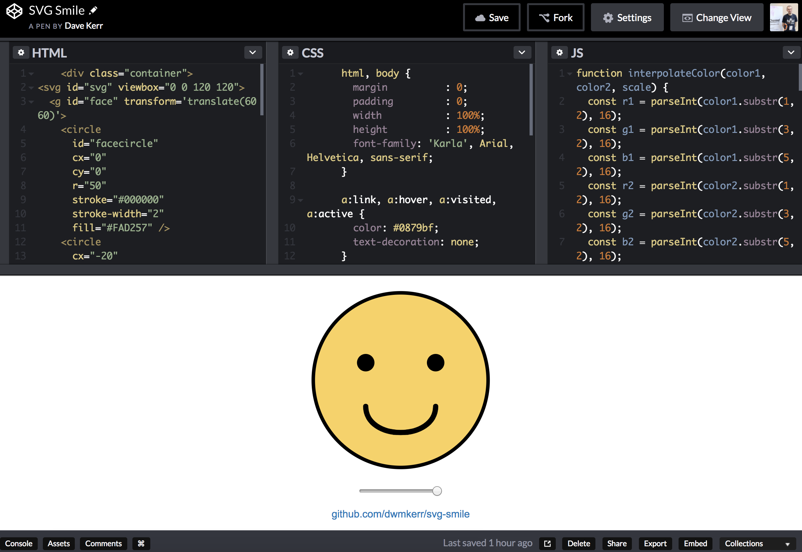

# svg-smile 😀🙂😐🙁☹️

Procedurally animated smiley face with SVG and pure JavaScript.

CodePen: https://codepen.io/dwmkerr/pen/ejejeX/

This is a simple project I put together to learn how to do pure JavaScript animations of SVG data. Moving the slider will animate the geometry of the smile path and the colour of the face.

You call also check this out on CodePen

