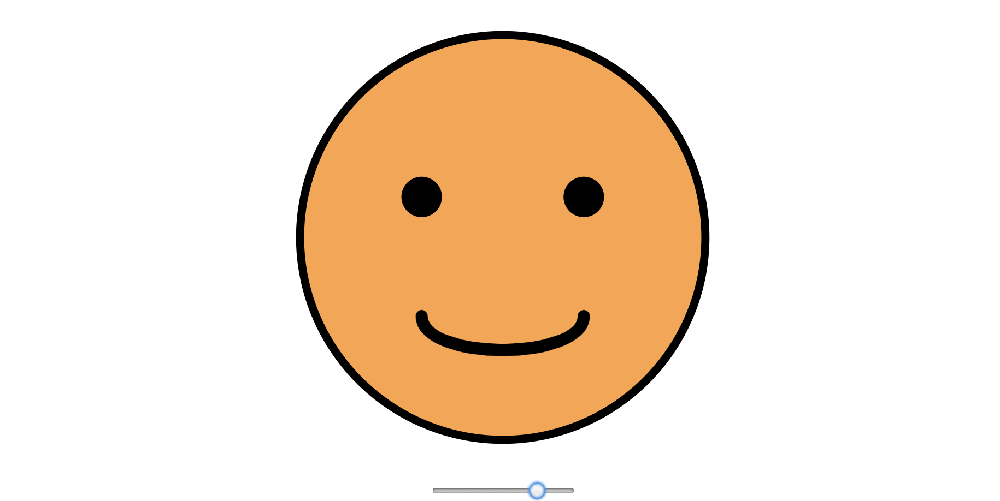

# svg-smile 😀🙂😐🙁☹️

Procedurally animated smiley face with SVG and pure JavaScript.

See it live at [dwmkerr.github.io/svg-smile](https://dwmkerr.github.io/svg-smile/).

## Introduction

This is a simple project I put together to learn how to do pure JavaScript animations of SVG data. Moving the slider will animate the geometry of the smile path and the colour of the face.

See the Pen <a href="https://codepen.io/dwmkerr/pen/ejejeX/">SVG Smile</a> by Dave Kerr (<a href="https://codepen.io/dwmkerr">@dwmkerr</a>) on <a href="https://codepen.io">CodePen</a>.

